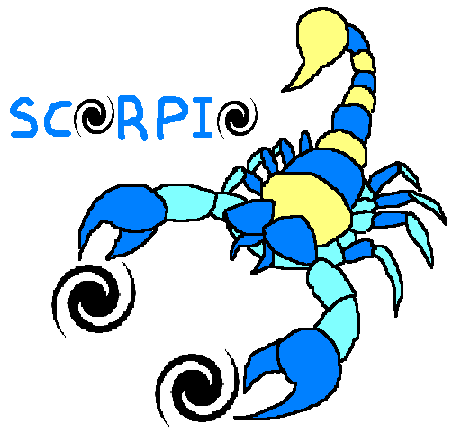

.. SCORPIO documentation master file, created by
   sphinx-quickstart on Tue Dec  8 12:43:51 2020.
   You can adapt this file completely to your liking, but it should at least
   contain the root `toctree` directive.

Welcome to SCORPIO's documentation!
===================================

.. only:: html

.. image:: https://travis-ci.com/josegit88/SCORPIO.svg?branch=master
    :target: https://travis-ci.com/josegit88/SCORPIO
    :alt: Build Status

.. image:: https://readthedocs.org/projects/scorpio-rdd/badge/?version=latest
    :target: https://scorpio-rdd.readthedocs.io/en/latest/?badge=latest
    :alt: Documentation Status
    
.. image:: https://img.shields.io/badge/License-MIT-blue.svg
    :target: https://opensource.org/licenses/MIT
    :alt: License: MIT
    
.. image:: https://img.shields.io/badge/python-3.7+-blue.svg
    :target: https://www.python.org/downloads/release/python-370/
    :alt: Python 3.7+    

.. image:: https://img.shields.io/badge/DiSoftCompCi-FAMAF-ffda00
   :target: https://github.com/leliel12/diseno_sci_sfw
   :alt: Curso doctoral FAMAF: Diseño de software para cómputo científico

.. Escribir una descripcion corta del proyecto aca:

**SCORPIO** (Sky COllector of galaxy Pairs and Image Output)

Is a tool to quick generate images of galaxy pairs, using data from different surveys.

| **Authors**
| Jose Benavides (E-mail: jose.benavides@gmail.com)

Repository and Issues
---------------------

https://github.com/josegit88/SCORPIO

---------------------

This program receives RA and Dec information from a pair of galaxies.
interacting (or nearby) or other individual objects and download the data
Corresponding .fits of survey data and list of filters:

******************************************************

        Survey              >>>      Filters

******************************************************

Sloan Digital sky Survey (SDSS) >>> [u, g, r, i, z]

Two Micron All Sky Survey (2MASS) >>> [J, H, K]

Wide Field Infrared Survey Explorer (WISE) >>> [3.4, 4.6, 12, 22]

Later it processes and exports an image.

For this it has a series of steps that use some specific purpose functions:

******************************************************

        Process              >>>      Function

******************************************************

Download .fits data          >>>    download_data

Stack the information        >>>      stack_pair

Calculate distance to the
observer Mpc and the
separation between the pair  >>>      distances

Generate the image           >>>      Image.plot

--------------------------------------------------

.. toctree::
   :maxdepth: 2
   :caption: Contents:

   api/modules
   installation.rst
   license.rst

Indices and tables
==================

* :ref:`genindex`
* :ref:`modindex`
* :ref:`search`
